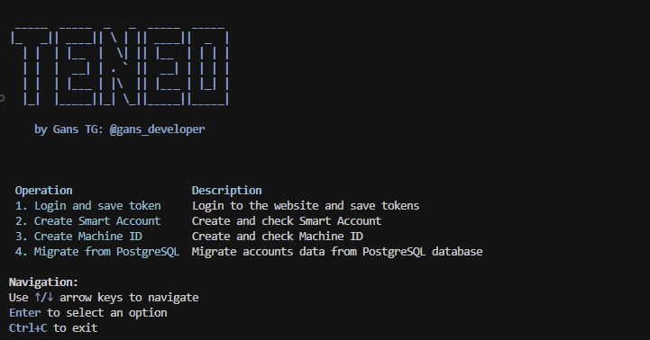

# Teneo Smart v1.2.0 🚀


> **Note:** This is paid software. 
> To purchase, contact via Telegram: [@gaansss](https://t.me/gaansss)

Teneo Smart is an automation tool for managing Teneo accounts, Smart Accounts, and Machine IDs on the Peaq network.



## Features ✨

- 🔐 Secure account authentication
- 💼 Create and manage Smart Accounts on the Peaq network
- 🆔 Create and manage Machine IDs (DIDs)
- 🔄 Multi-threaded processing
- 📊 Clean console interface

## Requirements 📋

- Python 3.11+ 🐍
- Linux or Windows operating system

## Installation 🔧

### Option 1: Use Executable Files

1. Download the appropriate executable for your platform:
   - Windows: `teneo_smart.exe`
   - Linux: `teneo_smart`

2. Make sure the executable has proper permissions (Linux only):
   ```bash
   chmod +x teneo_smart
   ```

### Option 2: Install from Source

1. Clone the repository:
   ```bash
   git clone <repository-url>
   cd teneo_smart
   ```

## Configuration ⚙️

Main settings in the `settings.yaml` file:

```yaml
# API settings
api:
  capsolver_api_key: "your_capsolver_api_key"  # Key for CAPTCHA solving service
  twocaptcha_api_key: "your_twocaptcha_api_key"  # Alternative service

# Performance settings
performance:
  thread_count: 5  # Number of threads for parallel processing

# Setting up streams and delays
account_delay: 5
request_timeout: 30

retry:
  attempts: 3
  delay: 15
```

### Data Files Format

1. `accounts.txt` - list of accounts:
   ```
   email1@example.com:password1
   email2@example.com:password2
   ```

2. `wallets.txt` - list of wallets with private keys (one per line):
   ```
   wallet:privatekey
   wallet:privatekey
   ```

3. `proxy.txt` - list of proxies (one per line):
   ```
   username:password@host:port
   ```

## License System 🔑

The application uses a license system to authenticate users:

1. When you run the application for the first time, you will be prompted to enter your license key
2. The license key will be verified with the license server
3. After successful verification, your license key will be saved in the `config.json` file

If you don't have a license key, please contact the developer.

## Usage 🖥️

### Running the Executable

#### Windows:
1. Run `teneo_smart.exe` by double-clicking it

#### Linux:
1. Make sure the file has execution permissions:
   ```bash
   chmod +x teneo_smart
   ```
2. Run the program:
   ```bash
   ./teneo_smart
   ```


## Main Operations 📝

- **Login to Account** - Log in to your Teneo account
- **Create Smart Account** - Create a Smart Account on the Peaq network
- **Create Machine ID** - Create a Machine ID (DID) on the Peaq network
- **Migrate from PostgreSQL** - Import accounts data from a PostgreSQL database

### Wallet Requirements ⚠️

To create a Smart Account or Machine ID, you need a wallet linked to your Teneo account. The wallet must be properly connected to process transactions on the Peaq network.

When providing wallet information in the `wallets.txt` file, you must include both the wallet address and its private key:
```
wallet:privatekey
```

The application will automatically match the private key with the corresponding linked wallet. The private key is required for generating signatures during the creation process.

> **Important**: Keep your private keys secure and never share them with unauthorized parties.

## Data Migration from Teneo Farmer 📤

If you previously used Teneo Farmer, you can migrate account data:

1. Select the "Migrate from PostgreSQL" option from the main menu
2. Enter the PostgreSQL connection details:
   - Host: usually localhost or server IP address
   - Port: standard port 5432
   - Database: usually "teneo"
   - Username: usually "postgres"
   - Password: your password
   - Table: table name with accounts, usually "accounts"

The migration process will transfer:
- Account emails
- Authentication tokens
- Wallet addresses

After successful migration, you can use these accounts in Teneo Smart without re-authentication.

## Troubleshooting 🔍

- If you encounter any issues with the license verification, check your internet connection
- Ensure the `settings.yaml` file is properly configured
- Check the logs in the `logs` directory for detailed error information

## Support 📞

For support, please contact the developer via Telegram: [@gaansss](https://t.me/gaansss)
